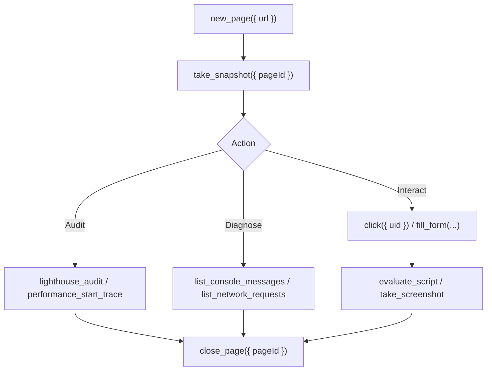

# Chrome DevTools MCP Skill

Official integration for `ChromeDevTools/chrome-devtools-mcp` providing deep Chrome DevTools Protocol (CDP) capabilities directly to AI agents.

## When to Use
- **Visual & UI Verification**: Take screenshots, inspect computed layout, or audit CSS rendering.
- **Performance Profiling**: Record Chrome performance traces, extract Core Web Vitals (LCP, INP, CLS), identify render-blocking resources, and execute full Lighthouse audits.
- **Dynamic Interaction & Testing**: Click, fill forms, hover, drag, and simulate keyboard inputs using robust accessibility tree UIDs (`take_snapshot`).
- **Runtime Diagnostics**: Inspect console warnings/errors, monitor and inspect HTTP network requests/responses, and profile V8 memory heap snapshots.
- **Emulation**: Test mobile viewports, network conditions (Slow 3G, Fast 4G), CPU throttling (4x, 6x slowdown), and dark/light color schemes.

---

## Tool Reference (`ServerName: "chrome-devtools"`)

### 1. Page Lifecycle
- `new_page({ url: string, background?: boolean, isolatedContext?: string, timeout?: number })`
- `navigate_page({ pageId: number, url: string, timeout?: number })`
- `list_pages()`
- `select_page({ pageId: number })`
- `close_page({ pageId: number })`
- `resize_page({ pageId: number, width: number, height: number, deviceScaleFactor?: number })`

### 2. Snapshots & Visual Verification
- `take_snapshot({ pageId: number, verbose?: boolean })` -> Returns accessibility tree with unique element `uid`s for reliable interaction.
- `take_screenshot({ pageId: number, fullPage?: boolean, format?: "png" | "jpeg" | "webp", quality?: number, uid?: string })`
- `take_heapsnapshot({ pageId: number })` -> Captures V8 heap profile for memory leak analysis.

### 3. User Automation
- `click({ pageId: number, uid: string, button?: "left" | "right" | "middle", clickCount?: number })`
- `fill({ pageId: number, uid: string, value: string })`
- `fill_form({ pageId: number, elements: Array<{ uid: string, value: string }> })`
- `type_text({ pageId: number, text: string, delay?: number })`
- `press_key({ pageId: number, key: string })`
- `hover({ pageId: number, uid: string })`
- `drag({ pageId: number, fromUid: string, toUid: string })`
- `wait_for({ pageId: number, selector?: string, text?: string, timeout?: number })`
- `handle_dialog({ pageId: number, action: "accept" | "dismiss", promptText?: string })`

### 4. Console & Network Diagnostics
- `evaluate_script({ pageId: number, function: string, args?: string[], waitForStableDom?: boolean })`
- `list_console_messages({ pageId: number, types?: string[] })`
- `get_console_message({ pageId: number, messageId: number })`
- `list_network_requests({ pageId: number, resourceTypes?: string[], statusCodes?: number[] })`
- `get_network_request({ pageId: number, requestId: string })`

### 5. Performance & Auditing
- `lighthouse_audit({ pageId: number, categories?: string[], device?: "mobile" | "desktop" })`
- `performance_start_trace({ pageId: number, reload?: boolean, screenshots?: boolean })`
- `performance_stop_trace({ pageId: number })`
- `performance_analyze_insight({ pageId: number, insightSetKey: string, insightName: string })`
- `emulate({ pageId: number, colorScheme?: "dark" | "light", cpuThrottlingRate?: number, networkConditions?: object })`

---

## Standard Workflow Pattern

### Example: Running a Performance & Core Web Vitals Audit
1. Open target URL: `new_page({ url: "https://usgarhoteles.com" })`
2. Start trace: `performance_start_trace({ pageId: 2, reload: true })`
3. Stop trace: `performance_stop_trace({ pageId: 2 })`
4. Run Lighthouse: `lighthouse_audit({ pageId: 2, categories: ["performance", "accessibility", "best-practices", "seo"], device: "desktop" })`
5. Clean up: `close_page({ pageId: 2 })`