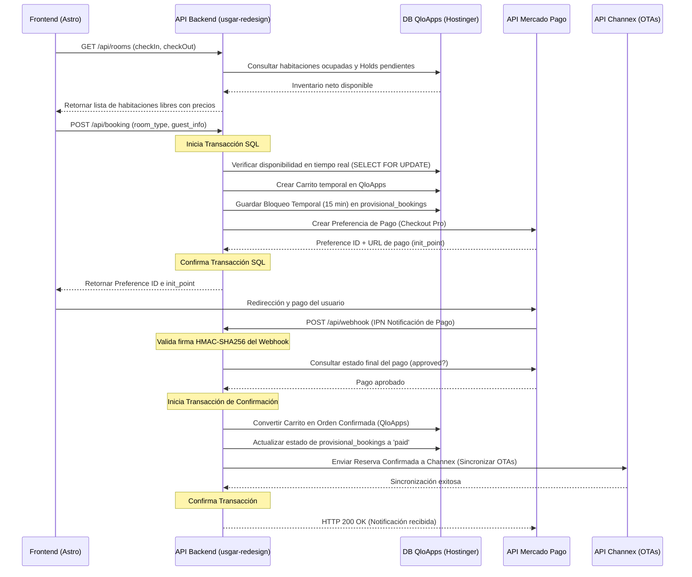

# USGAR Hotels - Backend Redesign (usgar-redesign)

Este repositorio contiene el rediseño estructurado y limpio del backend de reservas para **USGAR Hotels**, implementado en **PHP 8.x** nativo y optimizado para entornos de hosting compartido (como **Hostinger**).

El sistema actúa como una API intermedia entre el frontend de usuario (Astro), la base de datos centralizada de **QloApps** (CMS hotelero) y los servicios externos de **Mercado Pago** (pasarela de pagos) y **Channex** (channel manager para la distribución OTA).

---

## 🛠️ Arquitectura y Principios de Diseño

El código sigue los principios de diseño **SOLID** y mantiene una separación estricta de responsabilidades (Separation of Concerns) sin dependencias externas pesadas, asegurando que la carga y ejecución en servidores compartidos sea rápida, segura y portable.

### Capas del Sistema:
1. **Core (`src/Core/`)**: Infraestructura básica e independiente de la lógica de negocio (Autocargador PSR-4, Enrutador, Base de Datos, Manejadores de Peticiones y Respuestas, Logger, Limitador de peticiones).
2. **Controladores (`src/Controllers/`)**: Puntos de entrada HTTP que reciben la petición a través del Router, validan los parámetros de entrada y delegan la lógica a los servicios.
3. **Servicios (`src/Services/`)**: Contienen la lógica de negocio pura e integraciones con terceros (QloApps, Mercado Pago, Channex).
4. **Modelos (`src/Models/`)**: Abstracciones del acceso a base de datos utilizando PDO y sentencias preparadas contra tablas locales y de QloApps.

---

## 🔄 Flujo General de Reservas

El backend gestiona el ciclo de vida completo de una reserva de forma transaccional:



---

## 🚀 Requisitos de Instalación

1. **PHP 8.0 o superior** con las extensiones habilitadas:
   - `pdo` y `pdo_mysql` (Conexiones a base de datos)
   - `curl` (Llamadas a Mercado Pago y Channex)
   - `openssl` y `hash` (Para la validación HMAC-SHA256)
   - `json` (Para parsear las peticiones y respuestas)
2. **Servidor Web Apache** con módulo `mod_rewrite` habilitado (Hostinger por defecto lo tiene).

---

## ⚙️ Configuración y Despliegue en Hostinger

1. Sube la carpeta `usgar-redesign` al directorio principal o una carpeta alternativa en tu servidor compartido (ej. `public_html/usgar-redesign`).
2. Copia el archivo `.env.example` a `.env` y configura tus credenciales reales de base de datos y tokens de APIs:
   ```bash
   cp .env.example .env
   ```
3. Asegúrate de configurar la base de datos de QloApps y añadir la tabla para bloqueos temporales `provisional_bookings`:
   ```sql
   CREATE TABLE IF NOT EXISTS `provisional_bookings` (
     `id` int(11) NOT NULL AUTO_INCREMENT,
     `cart_id` varchar(64) NOT NULL,
     `mercado_pago_preference_id` varchar(64) DEFAULT NULL,
     `id_hotel` int(11) NOT NULL,
     `id_room_type` int(11) NOT NULL,
     `guest_data` text NOT NULL,
     `room_data` text NOT NULL,
     `price_snapshot` decimal(10,2) NOT NULL,
     `checkin` date NOT NULL,
     `checkout` date NOT NULL,
     `status` enum('pending','paid','failed','expired') NOT NULL DEFAULT 'pending',
     `expires_at` datetime NOT NULL,
     `created_at` timestamp NOT NULL DEFAULT CURRENT_TIMESTAMP,
     `updated_at` timestamp NOT NULL DEFAULT CURRENT_TIMESTAMP ON UPDATE CURRENT_TIMESTAMP,
     PRIMARY KEY (`id`),
     UNIQUE KEY `cart_id` (`cart_id`),
     KEY `expires_at` (`expires_at`),
     KEY `status` (`status`)
   ) ENGINE=InnoDB DEFAULT CHARSET=utf8mb4;
   ```
4. Configura una tarea programada (Cron Job) en Hostinger para ejecutar el script de limpieza de holds expirados cada 5 minutos:
   ```bash
   php -f /home/uXXXXX/public_html/usgar-redesign/public/index.php /api/cron/cleanup
   ```
