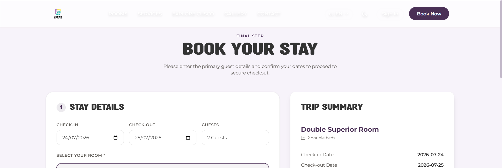
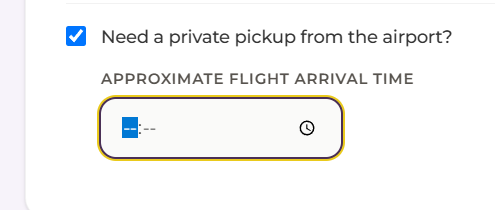
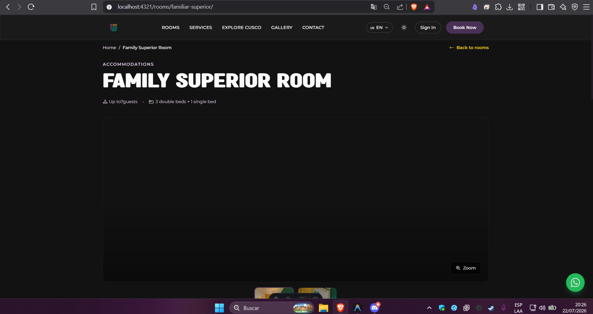
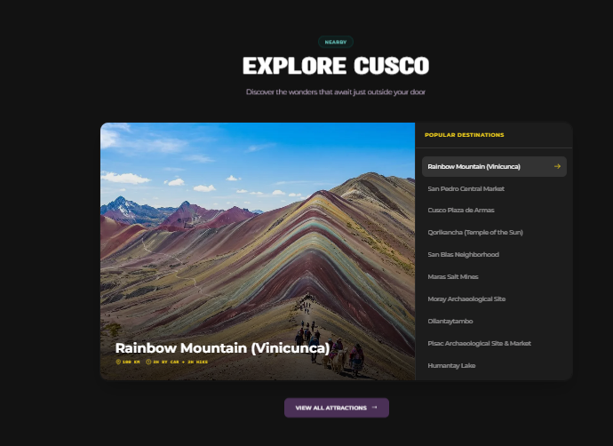
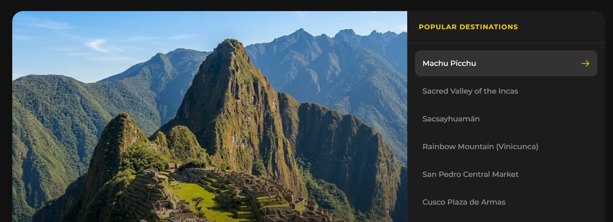

puntos a mejorar:
    1.- Realizar un mejoras de visualizacion para accesitibilidad en modo claro con el navbar, cuando el usuario cambia de tema 
    2.- En la seccion I need pickup en reservas, buscar porque no funciona. 
    3.-  tarda entre 2-5 segundos en realizar la peticion al servidor y renderizar la imagen completa.
    4.-  hacer que explore cusco funcione correctamente para poder ser redireccionado por ejemplo de  a http://localhost:4321/explore/machu-picchu/ pero como tal no existe
    5.- mejorar la experiencia del usuario en Explore Cusco y eliminar el ovalo de nearby que se encuentra en su parte superior.
    6.- corregir el problema de las tildes en la fuente de akhirtahun.woff2 y kravitz_.woff2
    7.- corregir el problema de rendimiento de las imagenes 
